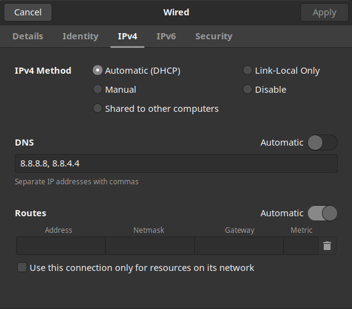

# How to change your DNS

You may be wondering what DNS is, and why would I want to change my DNS? So DNS stands for Domain Name Services, and it's how your computer takes a domain name such as google.com and changes it into an ip address in order to visit it. I won't go into too much detail on how it works but if you are interested I have some notes on DNS [here](https://github.com/logan-lieou/Cyber_Notes/blob/master/Networking/OSIModel/ApplicationLayer/DNS.md) so why would you want to change your DNS provider? Because fuck ISPs.

So how do you do this? Now obviously there's many differnet DNS servers that you can use. Some common ones include those provided by cisco through open dns, and those provided by google through google public dns. You can see google's dns [here](https://developers.google.com/speed/public-dns/) this is the one we're going to use today and it's very easy to use google even has a tutorial on their site as well [here](https://developers.google.com/speed/public-dns/docs/using) the easiest way to change your DNS on unix based systems is edit /etc/resolv.conf/ `sudo [TEXTEDITOR] /etc/resolv.conf/` 

The /etc/resolv.conf/ file has been edited through another method on my system but the idea is very simple you just replace your current nameserver with 8.8.8.8, 8.8.4.4 etc. this would be the easiest way to do, but that's not the only way to do so the other way you can do it is by going into network settings, and clicking the gear icon by your wifi or ethernet connection.

And under the ipv4 and ipv6 settings you want to replace those with your new DNS, be it the google dns ip's or the open dns ips. Be sure to set Automatic DHCP only, when you are doing this as well.

## On MacOS

Apple menu > System Preferences > Network, unlock, select the connection wifi or ethernet, and click on advanced, select DNS and press + to replace any listed address with or adding the new DNS , then just apply the settings

## On Windows

Quit leave, I don't know just look on google or something.
